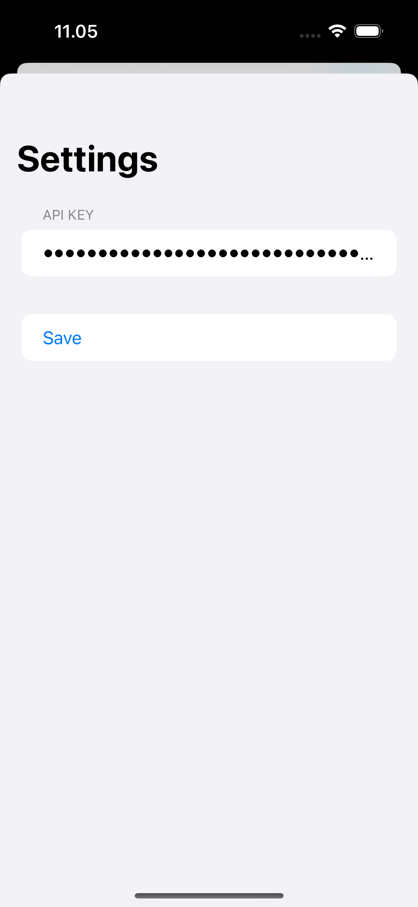

# Aleyya - AI Chatbot iOS App

Aleyya is a sophisticated iOS chatbot application that leverages the power of various AI models through the OpenRouter API. This app provides users with a seamless interface to interact with advanced language models, including support for image-based conversations with compatible models.

## Screenshots

<table>
  <tr>
    <td></td>
    <td></td>
    <td></td>
  </tr>
  <tr>
    <td align="center">Chat Screen</td>
    <td align="center">Select Model</td>
    <td align="center">Settings / API Key</td>
  </tr>
</table>

## Features

- Real-time chat with AI models
- Support for multiple AI models:
  - GPT-4o
  - Sonnet 3.5
  - Opus
  - Qwen 2 7B Instruct
  - Mistral 7B Instruct
  - Llama 3.1 8B Instruct
  - Gemini Flash 1.5
- Image upload functionality for supported models (from gallery or camera)
- Automatic image resizing to 512x512 pixels maximum
- Easy model switching
- Modern and intuitive user interface

## Requirements

- iOS 14.0+
- Xcode 12.0+
- Swift 5.3+
- An OpenRouter API key

## Technologies Used

- SwiftUI for the user interface
- Combine for asynchronous programming
- MVVM (Model-View-ViewModel) architecture
- URLSession for network requests

## Setup

1. Clone the repository
2. Open the project in Xcode
3. Obtain an API key from [OpenRouter](https://openrouter.ai/)
4. Update the Info.plist file:
   - Right-click on Info.plist in the Xcode project navigator
   - Select "Open As" > "Source Code"
   - Add the following keys and descriptions inside the `<dict>` tag:
     ```xml
     <key>NSPhotoLibraryUsageDescription</key>
     <string>Aleyya needs access to your photo library to upload images for AI analysis.</string>
     <key>NSCameraUsageDescription</key>
     <string>Aleyya needs access to your camera to take photos for AI analysis.</string>
     ```
5. Run the app and input your API key in the settings

## Usage

1. Launch the app and go to Settings to input your OpenRouter API key
2. Return to the main chat screen and select your preferred AI model
3. Type a message or upload an image (for supported models)
   - To upload an image, grant the app permission to access your photo library or camera when prompted
   - Images larger than 512x512 pixels will be automatically resized
4. Send your message and receive AI-generated responses
5. Switch models or start a new chat as needed

## Developer

This app was developed by Dody Rachmat Wicaksono, a passionate iOS developer with a keen interest in AI and machine learning applications.

## Contact

For any projects, improvements, or inquiries, please contact me at:

Email: dody@nicecoder.com

## License

This project is licensed under the MIT License - see the [LICENSE.md](LICENSE.md) file for details.

## Acknowledgments

- OpenRouter for providing access to various AI models
- The SwiftUI and Combine frameworks for enabling rapid iOS development
- The open-source community for inspiration and shared knowledge

---

Feel free to star ⭐ this repository if you find it useful!